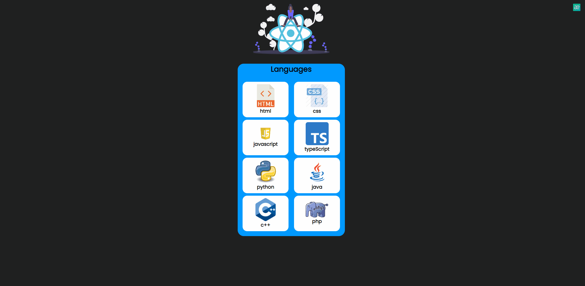

# Language Cards 🚀

  Project Name       |Libraries and Technologies I use     |How does my project look   
:-------------------------|-------------------------|-------------------------
[Language_Card](https://cards-language.netlify.app)| Js React | 

## Description

Project aims to create a Languages Cards App.

## Problem Statement

- We are adding a new project to our portfolios. So you and your colleagues have started to work on the project.

## Project Skeleton

```
002-Language Cards(folder)
|
|----readme.md         # Given to the students (Definition of the project)
SOLUTION
├── public
│     └── index.html
├── src
│    ├── components
│    │       └── card
│    │             ├── Card.css
│    │             └── Card.js
│    ├── helper
│    │       └── data.js
│    ├── assets.js
│    │       └── [images]
│    ├── App.js
│    ├── App.css
│    ├── index.js
│    └── index.css
├── package.json
└── yarn.lock
```

## Objective

Build a Languages Cards App using ReactJS.

### At the end of the project, following topics are to be covered;

- HTML

- CSS

- JS

- ReactJS

### At the end of the project, students will be able to;

- improve coding skills within HTML & CSS & JS & ReactJS.

- use git commands (push, pull, commit, add etc.) and Github as Version Control System.

## Steps to Solution

- Step 1: Create React App using `npx create-react-app language-cards`

- Step 2: Build Languages Cards app using [data.js](data.js), images in [assets](./assets/) folder.

- Step 4: Push your application into your own public repo on Github

- Step 5: Add project gif to your project and README.md file.

## Notes

- You can add additional functionalities to your app.
